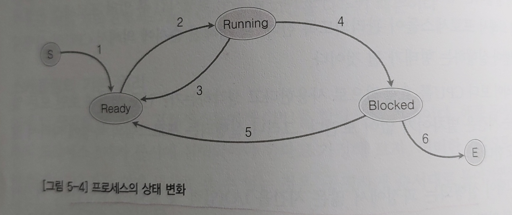

# 운영체제

1. #### [프로세스](#프로세스)

   - [프로세스의 의미](#프로세스의-의미)
   - [프로세스의 구성요소](#프로세스의-구성-요소)
     - 전역변수와 static 변수의 차이점은?
   - [프로세스 스케줄링이란?](#프로세스-스케줄링)
     - 선점형 OS와 비선점형 OS의 차이점
     - 스케줄링 알고리즘을 아는가?
   - [프로세스의 상태변화를 설명하시오](#프로세스의-상태변화)
     - Running > Ready 와 Running > Blocked의 차이점은?
   - [컨텍스트 스위칭이란?](#컨텍스트-스위칭)

2. #### [커널](커널)

   - [커널/커널 오브젝트의 의미](#커널의-의미)
   - [핸들의 의미](#핸들의-의미)
   - [커널오브젝트의 특징/핸들의 특징](#커널오브젝트와-핸들의-특징)

  

# 프로세스

> ## 프로세스의 의미

메모리 할당이 이루어지고 실행중인 프로그램을 의미

  

> ## 프로세스의 구성 요소

| 구성 요소 | 내용                     |
| --------- | ------------------------ |
| code      | 실행파일의 명령어가 저장 |
| data      | 전역변수, static 변수    |
| stack     | 지역변수, 인자값 등      |
| heap      | 동적할당을 위해 존재     |

### 전역변수와 static 변수의 차이점은?

- ##### 전역변수

  다른 파일에서도 쓸 수 있는 변수

- ##### static변수

  선언된 파일만 접근 가능한 변수

  

> ## 프로세스 스케줄링

프로세스의 CPU할당 순서 및 방법을 결정하는 일

- #### 스케줄러

  스케줄링을 담당하는 소프트웨어 요소. 운영체제의 요소이다.
  
   

#### 선점형 OS와 비선점형 OS의 차이점

**선점형 OS**는 우선순위가 높은 프로세스가 생성될 경우 해당 프로세스에게 CPU를 할당하는 시스템.

비선점형 OS에 비해 스케줄러가 하는 작업이 많다.

스케줄러가 실행순서를 조절해주다보니 프로그래머는 우선순위에 대해 거의 신경 쓰지 않아도 되니, 멀티 프로세스 기반 OS에 적합하다.

오늘날 접하는 모든 OS는 선점형 OS라고 생각하면 된다.(ex. Windows)

 

**비선점형 OS**는 현재 실행중인 프로세스가 CPU를 양보할 때까지, 혹은 I/O 작업 등으로 블로킹 상태에 놓일 때까지 CPU를 사용하는 것. 

따라서 프로그래머가 프로그램 설계시 프로그램의 우선순위를 잘 설계해야 한다.

인터렉티브한 프로그램 구현시 문제점 발생.

 

 

#### 스케줄링 알고리즘을 아는가?

- 우선순위 스케줄링

  각각의 프로세스마다 우선순위를 부여해서 우선순위가 높은 프로세스를 먼저 실행시키는 방식

- 라운드 로빈 스케줄링

  정해진 시간간격만큼 실행을 하고 (우선순위가 동일한 것 먼저) 다른 프로세스에게 CPU의 할당을 넘기는 방식

  

> ## 프로세스의 상태변화

1. ### Start > Ready

   프로세스가 생성된 상태. 프로세스는 생성되면 바로 Ready상태가 되어 CPU할당을 기다린다

2. ### Ready > Running

   프로세스가 스케줄러에 의해 선택되어 CPU에서 실행되는 상태

3. ### Running > Ready

   우선순위가 더 높은 프로세스가 생겨서 실행되던 프로세스가 Ready상태로 변경

4. ### Running > Blocked

   데이터 입,출력으로 blocked상태로 변경

5. ### Blocked > Ready

   데이터 입,출력 완료 후 Ready상태로 변경

6. ### Blocked > Exit

   프로세스 종료

 

### Running > Ready 와 Running > Blocked의 차이점

- ##### **Running > Ready**

  우선순위가 더 높은 프로세스에게 CPU를 양보하는 과정

- ##### **Running > Blocked**

  데이터 입,출력 때문에 프로세스가 Blocked되는 과정

  

> ## 컨텍스트 스위칭

현재 실행중인 프로세스 관련 레지스터 정보를 메모리에 저장하고, 이제 실행할 프로세스 관련 레지스터 정보를 CPU의 레지스터에 가져오는 작업

 

실행되는 프로세스의 변경과정에서 발생하는 컨텍스트 스위칭은 시스템에 많은 부담을 준다.

 

 

# 커널

> ## 커널의 의미

- #### 커널

  컴퓨터를 운영하는 데 있어서 중심이 되는 운영체제 핵심 부분

- #### 커널 오브젝트

  프로세스, 쓰레드, 파일과 같은 리소스들을 원할하게 관리하기 위해 필요한 정보를 저장해야 하는데,

  이때 데이터를 저장한는 메모리 블록을 커널 오브젝트라고 한다

  

> ## 핸들의 의미

핸들이란 커널오브젝트를 간접적으로 변경시키기 위해 커널 오브젝트에 할당되는 숫자

  

> ## 커널오브젝트와 핸들의 특징

- #### 커널오브젝트

  1. 운영체제에 종속적이다. 
  2. 따라서, 커널 오브젝트의 소멸 시점은 운영체제에 의해서 결정된다.
  3. 또한, 여러 프로세스에 의해서 접근이 가능하다.

   

- #### 핸들

  1. 프로세스에 종속적이다.

