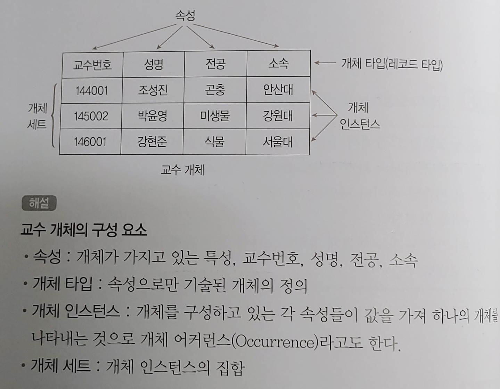
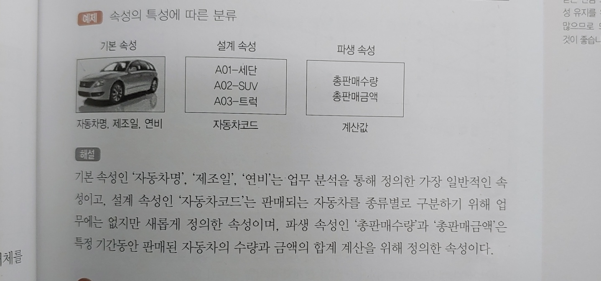

# 31. 데이터 전환(C)

1. ### 데이터 전환

   기존 정보 시스템의 데이터를 새로 개발할 시스템에서 운영할 수 있도록 **추출(Extraction), 변환(Transformation), 적재(Loading)** 하는 과정

    

2.  ### 데이터 전환 계획서

   데이터 전환작업에 필요한 모든계획을 기록하는 문서

  

# 32. 데이터 검증(C)

1. ### 데이터 검증

   데이터 전환 과정이 정상적으로 수행되었는지 확인하는 과정

    

2. ### 검증 방법에 따른 분류

   | 검증 방법          | 내용                                                         |
   | ------------------ | ------------------------------------------------------------ |
   | 로그 검증          | 데이터 전환 과정에서 작성하는 추출, 전환, 적재 로그를 검증   |
   | 기본 항목 검증     | 로그 검증 외에 별도로 요청된 검증 항목에 대해 검증           |
   | 응용 프로그램 검증 | 응용 프로그램을 통한 데이터 전환의 정합성 검증               |
   | 응용 데이터 검증   | 사전에 정의된 업무 규칙을 기준으로 데이터 전환의 정합성 검증 |
   | 값 검증            | 숫자 항목의 합계 검증, 코드 데이터의 범위 검증, 속성 변경에 따른 값 검증을  수행 |

    

3. ### 검증 단계에 따른 분류

   | 검증 단계    | 목적                                                         | 검증 방법                               |
   | ------------ | ------------------------------------------------------------ | --------------------------------------- |
   | 추출         | 원천 시스템 데이터에 대한 정합성 확인                        | 로그 검증                               |
   | 전환         | - 매핑 정의서에 정의된 내용이 정확히 반영 되었는지 확인 - 매핑 정의서 오류 여부 확인 | 로그 검증                               |
   | DB 적재      | 파일을 적재하는 과정에서 발생할 수 있는 오류, 데이터 누락 여부 등 확인 | 로그 검증                               |
   | DB 적재 후   | 적재 완료 후 정합성 확인                                     | 기본 항목 검증                          |
   | 전환 완료 후 | 데이터 전환 완료 후 추가 검증 과정을 통해 정합성 검증        | 응용프로그램 검증 응용 데이터 검증 |

  

# 33. 오류 데이터 측정 및 정제(C)

1. ### 오류 데이터 측정 및 정제

   - 고품질의 데이터를 운영 및 관리하기 위해 수행

   - `데이터 품질 분석 > 오류 데이터 측정 > 오류 데이터 정제` 순으로 진행

      

2. ### 오류 상태

   | 상태       | 내용                                                         |
   | ---------- | ------------------------------------------------------------ |
   | Open       | 오류가 보고만 되고 분석되지 않은 상태                        |
   | Assigned   | 개발자에게 오류를 전달한 상태                                |
   | Fixed      | 개발자가 오류를 수정한 상태                                  |
   | Closed     | 수정된 오류를 테스트해서 오류가 발견되지 않은 상태           |
   | Deffered   | 오류 수정을 연기한 상태                                      |
   | Classified | 보고된 오류를 관련자들이 확인했는데 오류가 아니라고 확인된 상태 |

    

3. ### 데이터 정제요청서

   데이터 정제와 관련된 전반적인 내용을 문서로 작성한 것

    

4. ### 데이터 정제보고서

   데이터 정제가 정상적으로 완료되었는지 결과를 작성한 것

  

# 34. 데이터베이스 개요(A)

1. ### 데이터 저장소

   - ##### 논리 데이터 저장소

     논리적인 구조로 조직화 한 저장소

   - ##### 물리 데이터 저장소

     물리적인 공간에 구축한 저장소

      

2. ### 데이터베이스

   공동으로 사용될 데이터를 중복을 배제하여 통합하고 저장장치에 저장하여 항상 사용할 수 있도록 운영하는 운영 데이터

   - ##### 운영 데이터

     조직의 고유한 업무를 수행하는데 필요한 자료

   - ##### 저장 데이터

     컴퓨터가 접근할 수 있는 저장매체에 저장된 자료

   - ##### 통합 데이터

     자료의 중복을 배제한 데이터의 모임

   - ##### 공용 데이터

     여러 응용시스템이 공동으로 소유하고 유지하는 자료

      

3. ### DBMS

   사용자의 요구에 따라 정보를 생성하고, 데이터 베이스를 관리해주는 소프트웨어

   ##### <필수 기능 3가지>

   - ##### 정의

     데이터의 정의, 이용방식, 제약 조건 등을 명시

   - ##### 조작

     데이터의 검색, 갱신, 삽입, 삭제를 위해 인터페이스 수단을 제공하는 기능

   - ##### 제어

     데이터 무결성, 보안, 권한 검사, 병행제어를 제공하는 기능

      

4. ### 데이터의 독립성

   - #####  물리적 독립성

     물리적 장치를 독립시킴으로써, 디스크를 추가/변경하더라도 응용 프로그램에는 영향을 끼치지 않음

   - ##### 논리적 독립성

     데이터의 논리적인 구조를 변경해도, 응용 프로그램에는 영향을 미치지 않음

      

5. ### 스키마

   데이터 베이스의 **구조**와 **제약조건**에 대한 전반적인 명세를 기술한 것

   | 종류        | 내용                                                         |
   | ----------- | ------------------------------------------------------------ |
   | 외부 스키마 | 데이터 베이스의 논리적 구조를 정의한 것                      |
   | 개념 스키마 | - 데이터 베이스의 전체적인 논리적 구조 - 모든 응용 프로그램이나 사용자들이 필요로 하는 데이터를 종합한 조직 전체의 데이터 베이스로 하나만 존재함 |
   | 내부 스키마 | 물리적 저장장치 입장에서 본 데이터베이스 구조                |

  

# 35. 데이터베이스 설계(A)

1. ### 데이터베이스 설계 시 고려사항

   | 항목    | 내용                                                         |
   | ------- | ------------------------------------------------------------ |
   | 무결성  | 데이터 조작 연산 후에도 데이터 베이스에 저장된 데이터가 제약조건을 항상 만족해야 함 |
   | 일관성  | 저장된 데이터들 사이나, 특정 질의에 대한 응답이 처음부터 끝까지 변함없이 일정해야 함 |
   | 보안    | 데이터의 노출, 변경, 손실로부터 보호할 수 있어야 함          |
   | 회복    | 장애 발생시 발생 직전의 상태로 복구할 수 있어야 함           |
   | 효율성  | 응답시간의 단축, 시스템의 생산성, 저장 공간의 최적화 등이 가능해야 함 |
   | DB 확장 | 데이터베이스 운영에 영향을 주지 않으면서 지속적으로 데이터를 추가할 수 있어야 함 |

    

2. ### 데이터베이스 설계 순서

   1. ##### 요구조건 분석

      요구 조건 명세서 작성

   2. ##### 개념적 설계

      개념 스키마, 트랜잭션 모델링, E-R 모델

   3. ##### 논리적 설계

      논리 스키마 설계, 트랜잭션 인터페이스 설계

   4. ##### 물리적 설계

      물리적 구조의 데이터로 변환

   5. ##### 구현

      데이터베이스 생성, 트랜잭션 작성

       

3. ### 요구 조건 분석

   데이터베이스를 사용할 사람들로부터 필요한 용도를 파악하는 것

    

4. ### 개념적 설계(정보 모델링, 개념화)

   - 현실 세계에 대한 인식을 추상적 개념으로 표현하는 과정

   - 개념 스키마 모델링, 트랜잭션 모델링을 병행 수행

      

5. ### 논리적 설계(데이터 모델링)

   - 현실 세계에서 발생하는 자료를 물리적 저장장치에 저장할 수 있도록 논리적 자료구조로 변환(mapping)시키는 과정
   - 트랜잭션 인터페이스를 설계한다

    

6. ### 물리적 설계(데이터 구조화)

   논리적 구조로 표현된 데이터를 물리적 구조의 데이터로 변환하는 과정

    

7. ### 데이터베이스 구현

   - 논리적 설계와 물리적 설계에서 도출된 데이터베이스 스키마를 파일로 생성하는 과정
   - 트랜잭션 작성

  

# 36. 데이터모델의 개념(B)

1. ### 데이터 모델

   현실 세계의 정보들을 단순화, 추상화하여 표현한 개념적 모형

   - ##### 데이터 모델 구성 요소

     개체, 속성, 관계

   - ##### 데이터 모델 종류

     개념적 데이터 모델, 논리적 데이터 모델, 물리적 데이터 모델

   - ##### 데이터 모델에 표시할 요소

     구조, 연산, 제약조건

      

2. ### 개념적 데이터 모델

   - 현실세계에 대한 인식을 추상적 개념으로 표현하는 과정

   - 정보모델이라고도 함

   - 대표적 모델로는 E-R 모델이 있음

      

3. ### 논리적 데이터 모델

   - 개념적 모델링 과정에서 얻은 개념적 구조를 컴퓨터 세계의 환경에 맞도록 변환하는 과정
   - 데이터 모델이라고 하면 논리적 데이터 모델을 말함
   - 관계모델, 계층 모델, 네트워크 모델 등이 있음

    

4. ### 데이터 모델에 표시할 요소

   | 요소     | 내용                                                         |
   | -------- | ------------------------------------------------------------ |
   | 구조     | 논리적으로 표현된 개체 타입들 간의 관계로서 데이터 구조 및 정적 성질 표현 |
   | 연산     | 데이터를 처리하는 작업에 대한 명세로서 데이터베이스를 조작하는 기본 도구 |
   | 제약조건 | 데이터베이스에 저장될 수 있는 실제 데이터의 논리적인 제약 조건 |

  

# 37. 데이터 모델의 구성 요소(B)

1. ### 개체

   데이터베이스에 표현하려는 것, 개념이나 정보 단위 같은 현실 세계의 대상

   

    

2. ### 속성

   - 데이터베이스를 구성하는 가장 작은 논리적 단위

   - 속성의 수를 디그리(degree)  또는 차수라고 한다

      

3. ### 속성의 특성에 따른 분류

   | 분류      | 내용                                                         |
   | --------- | ------------------------------------------------------------ |
   | 기본 속성 | - 속성 중 가장 많고 일반적임 - 업무 분석을 통해 정의한 속성 |
   | 설계 속성 | - 원래 업무상 존재하지 않고 설계 과정에서 도출해내는 속성    |
   | 파생 속성 | - 다른 속성으로부터 계산이나 변형 등의 영향을 받아 발생하는 속성 - 파생 속성은 되도록 적은 수를 정의하는 것이 좋음 |

   

    

4. ### 속성의 개체 구성 방식에 따른 분류

   | 분류        | 내용                                                         |
   | ----------- | ------------------------------------------------------------ |
   | 기본키 속성 | 개체를 유일하게 식별할 수 있는 속성                          |
   | 외래키 속성 | 다른 개체와의 관계에서 포함된 속성                           |
   | 일반 속성   | 개체에 포함되어 있고 기본키, 외래키에 포함되어 있지 않은 속성 |

    

5. ### 관계

   개체와 개체 사이의 논리적인 연결

    

6. ### 관계의 형태

   - 1 : 1

   - 1 : 다

   - 다 : 다

      

7. ### 관계의 종류

   | 종류      | 내용                                                         |
   | --------- | ------------------------------------------------------------ |
   | 종속 관계 | - 두 개체 사이의 주종관계를 표현한 것 - 식별관계, 비식별관계가 있음 |
   | 중복 관계 | 두 개체 사이에 두번 이상의 종속 관계가 발생하는 관계         |
   | 재귀 관계 | - 개체가 자기 자신과 관계를 가지는 것 - 순환 관계라고도 함 |
   | 배타 관계 | - 개체의 속성이나 구분자를 기준으로 개체의 특성을 분할 - 배타 AND 관계와 배타 OR 관계로 구분 |

  

# 38. 식별자(D)

1. ### 식별자

   하나의 개체 내에서 인스턴스를 유잏라게 구분할 수 있는 구분자

    

2. ### 식별자의 분류

   | 분류             | 식별자                                                       |
   | ---------------- | ------------------------------------------------------------ |
   | 대표성 여부      | - 주 식별자 : 개체를 대표하는 유일한 식별자 - 보조 식별자 : 주식별자를 대체하여 개체를 식별할 수 있는 속성 |
   | 스스로 생성 여부 | - 내부 식별자 : 개체 내에서 스스로 만들어지는 식별자 - 외부 식별자 : 외부 개체의 식별자를 가져와 사용하는 식별자 |
   | 단일 속성 여부   | - 단일 식별자 : 한가지 속성으로만 구성된 식별자 - 복합 식별자 : 두 개 이상의 속성으로 구성된 식별자 |
   | 대체 여부        | - 원조 식별자 : 업무에 의해 만들어지는 가공되지 않은 원래의 식별자 - 대리 식별자 : 주 식별자의 속성이 두 개 이상일 때, 속성들을 하나의 속성으로 묶어 사용하는 식별자 |

    

3. ### 후보 식별자

   개체에서 각 인스턴스를 유일하게 식별할 수 있는 속성 또는 속성 집합

    

4. ### 주 식별자의 특징

   | 특징   | 내용                                                         |
   | ------ | ------------------------------------------------------------ |
   | 유일성 | 개체 내의 모든 인스턴스는 주 식별자에 의해 구분되어야 함     |
   | 최소성 | 유일성을 만족시키기에 필요한 최소한의 속성으로만 구성        |
   | 불변성 | 주 식별자가 특정개체에 한 번 지정되면 그 식별자는 변하지 않아야 함 |
   | 존재성 | 주 식별자가 지정되면 식별자 속성에 반드시 데이터 값이 존재해야 함 |

  

# 39. E-R(개체-관계) 모델(A)

1. ### E-R(개체-관계) 모델

   - 현실세계의 무질서한 데이터를 개념적인 논리 데이터로 표현하기 위한 방법

   - 1976년 피터 첸에 의해 제안되었음

   - 개념적 데이터 모델의 가장 대표적인 것

   - E-R 모델에서는 데이터를 개체, 관계, 속성으로 묘사함

      

2. ### E-R 다이어그램

   

 

 

# 40. 관계형 데이터베이스의 구조 / 관계형 데이터 모델(A)

1. ### 관계형 데이터베이스

   - 2차원적인 표(Table)를 이용해서 데이터 상호 관계를 정의하는 데이터베이스
   - 개체 릴레이션과 관계 릴레이션이 존재함
   - 장점 : 간결하다, 다른 데이터베이스로의 변환이 용이하다
   - 단점 : 성능이 떨어진다

    

2. ### 관계형 데이터베이스의 릴레이션구조

   

    

3. ### 튜플

   - 릴레이션을 구성하는 각각의 행

   - 튜플의 수를 카디널리티 또는 기수 라고 함

      

4. ### 속성

   - 데이터 베이스를 구성하는 가장 작은 논리적 단위

   - 속성의 수를 디그리(Degree) 또는 차수라고 함

      

5. ### 도메인

   - 하나의 애트리뷰트가 취할 수 있는 같은 타입의 원자값들의 집합

      

6. ### 릴레이션의 특징

   - 릴레이션에 포함된 튜플들은 모두 상이하다

   - 튜플 사이에는 순서가 없다

   - 속성들의 순서는 중요하지 않다

   - 튜플들의 삽입, 삭제로 릴레이션은 시간에 따라 변한다

   - 속성의 값은 논리적으로 원자값만을 저장한다

      

7. ### 관계형 데이터 모델

   - 2차원적인 표(Table)를 이용해서 데이터 상호 관계를 정의하는 DB구조
   - 가장 널리 사용되는 데이터 모델
   - 관계형 모델의 대표적인 언어는 SQL이다

  

# 41. 관계형 데이터베이스의 제약 조건-Key(A)

1. ### 키

   데이터베이스에서 조건을 만족하는 튜플을 찾거나 순서대로 정렬할 때 기준이 되는 속성

    

2. ### 후보키

   - 속성들 중에서 튜플을 유일하게 식별하기 위해 사용되는 속성들의 부분집합

   - **유일성**과 **최소성**을 만족시켜야 함

   - ##### 유일성

     하나의 키 값으로 하나의 튜플만을 유일하게 식별

   - ##### 최소성

     키를 구성하는 속성 하나를 제거하면 유일하게 식별할 수 없도록 최소한의 속성으로 구성

    

3. ### 기본키

   - 후보키 중에서 선정된 주키

   - 중복값을 가질 수 없다

   - NULL값을 가질 수 없다

      

4. ### 대체키

   후보키가 둘 이상일 때 기본키를 제외한 나머지 후보키

    

5. ### 슈퍼키

   - 한 릴레이션 내에 있는 속성들의 집합으로 구성된 키

   - 유일성 만족o, 최소성 만족x

      

6. ### 외래키

   다른 릴레이션의 기본키를 참조하는 속성 또는 속성들의 집합

  

# 42. 관계형 데이터베이스의 제약조건 - 무결성(Integrity)(A)

1. ### 무결성

   - 데이터베이스에 저장된 데이터값과 현실세계의 실제값이 일치하는 정확성

   - 쉽게말해서, 저장된 데이터베이스에 잘못된 데이터가 없다는 것

      

2. ### 무결성의 종류

   - #### 개체 무결성

     기본키를 구성하는 어떤 속성도 NULL값이나 중복값을 가질 수 없다

   - #### 참조 무결성

     외래키값은 NULL이거나 참조 릴레이션의 기본키 값과 동일해야 한다

   - #### 도메인 무결성

     주어진 속성 값이 정의된 도메인에 속한 값이어야 한다

   - #### 사용자 정의 무결성

     속성 값들이 사용자가 정의한 제약조건에 만족되어야 한다

   - #### NULL 무결성

     릴레이션의 특정 속성 값이 NULL이 될 수 없도록 하는 규정

   - #### 고유 무결성

     릴레이션의 특정 속성에 대해 튜플들이 갖는 속성 값들이 서로 달라야 한다

   - #### 키 무결성

     하나의 릴레이션에는 적어도 하나의 키가 존재한다

   - #### 관계 무결성

     - 릴레이션에 어느 한 튜플의 삽입 가능 여부

     - 한 릴레이션과 다른 릴레이션의 튜플들 사이의 관계에 대한 적절성 여부

        

3. ### 데이터 무결성 강화

   | 종류                | 내용                                                       |
   | ------------------- | ---------------------------------------------------------- |
   | 애플리케이션        | 무결성 조건을 검증하는 코드를 프로그램 내에 추가함         |
   | 데이터베이스 트리거 | 트리거 이벤트에 무결성 조건을 실행하는 절차형 SQL을 추가함 |
   | 제약 조건           | 데이터베이스 제약조건을 설정하여 무결성 유지               |

  

# 43. 관계대수 및 관계해석(A)

1. ### 관계대수

   - 관계형 데이터베이스에서 원하는 정보와 그 정보를 검색하기 위해 어떻게 유도하는가를 기술하는 **절차적인** 언어

   - 순수관계연산자와 일반 집합 연산자가 있다

      

2. ### 순수 관계 연산자

   

    

3. ### 일반 집합 연산자

   

    

4. ### 관계해석

   - 관계 데이터의 연산을 표현하는 방법
   - 원하는 정보가 무엇이라는 것만 정의하는 **비절차적** 특성을 지닌다

  

# 44. 이상/함수적 종속(B)

1. ### 이상

   - ##### 삽입이상

     데이터를 삽입할 때 의도치 않게 원하지 않는 값들로 인해 삽입할 수 없게 되는 현상

   - ##### 삭제이상

     한 튜플을 삭제할 때 의도치 않게 상관없는 값들도 함께 삭제되는 현상

   - ##### 갱신이상

     튜플에 있는 속성 값을 갱신할 때 일부 튜플의 정보만 갱신되어 정보에 불일치성이 생기는 현상

      

2. ### 함수적 종속

   

   

 

# 45. 정규화(A)

1. ### 정규화

   가능한 한 중복을 제거하여 이상의 발생 가능성을 줄이기 위해 테이블을 무손실 분해하는 과정

    

2. ### 정규화 과정(1,2,3,BCNF,4,5)

   책 참고

  

# 46. 반정규화(A)

1. ### 반정규화

   - ##### 정규화된 데이터 모델을 의도적으로 통합, 중복, 분리하여 정규화 원칙을 위배하는 행위

   - ##### 성능 향샹, 관리 효율성 증가

   - ##### 데이터 일관성 저하, 정합성 저하

   - ##### 반정규화 방법

     - 테이블 통합
     - 테이블 분할
     - 중복 테이블 추가
     - 중복 속성 추가

    

2. ### 테이블 통합

   두개의 테이블이 조인되어 사용되는 경우가 많을 경우 성능 향상을 위해 하나의 테이블로 만들어 사용하는 것

    

3. ### 테이블 분할

   테이블을 수직 또는 수평으로 분할 하는 것

   | 방법      | 내용                                                         |
   | --------- | ------------------------------------------------------------ |
   | 수평 분할 | 레코드를 기준으로 테이블을 분할하는 것                       |
   | 수직 분할 | 하나의 테이블에 속성이 너무 많을 경우 속성을 기준으로 테이블을 분할 하는 것 |

    

4. ### 중복 테이블 추가

   작업의 효율성을 증가시키기 위해 테이블을 추가하는 것

   | 방법                                 | 내용                                                         |
   | ------------------------------------ | ------------------------------------------------------------ |
   | 집계 테이블의 추가                   | 집계 데이터를 위한 테이블을 생성하고 각 원본 테이블에 트리거를 설정하여 사용하는 것 |
   | 진행 테이블의 추가                   | 이력 관리 등의 목적으로 추가하는 테이블                      |
   | 특정 부분만을 포함하는 테이블의 추가 | 테이블의 특정 부분만으로 새로운 테이블을 생성                |

    

5. ### 중복 속성 추가

   - 자주 사용하는 속성을 하나 더 추가하는 것
   - 무결성 확보가 어렵고, 디스크 공간이 추가로 필요

  

# 47. 시스템 카탈로그(B)

1. ### 시스템 카탈로그

   - 다양한 객체에 관한 정보를 포함하는 시스템 데이터 베이스

   - DBMS에서 지원하는 모든 데이터 객체에 대한 정의나 명세에 관한 정보를 유지 관리하는 시스템 테이블

   - 데이터 사전이라고도 한다

      

2. ### 메타 데이터

   시스템 카탈로그에 저장된 정보를 의미

    

3. ### 데이터 디렉터리

   데이터 사전에 수록된 데이터에 접근하는데 필요한 정보를 관리, 유지하는 시스템

  

# 48. 데이터베이스 저장 공간 설계

1. ### 데이터베이스 저장공간 설계

   | 객체            | 내용                              |
   | --------------- | --------------------------------- |
   | 테이블          | 데이터베이스의 가장 기본적인 객체 |
   | 컬럼            | 테이블의 열을 구성하는 요소       |
   | 테이블 스페이스 | 테이블이 저장되는 논리적인 영역   |

    

2. ### 테이블 종류

   | 종류                     | 내용                                                         |
   | ------------------------ | ------------------------------------------------------------ |
   | 일반 테이블              | 대부분의 DBMS에서 표준 테이블로 사용되는 테이블 형태         |
   | 클러스터드 인덱스 테이블 | 기본키나 인덱스 키의 순서에 따라 데이터가 저장되는 테이블    |
   | 파티셔닝 테이블          | 대용량의 테이블을 작은 논리적 단위인 파티션으로 나눈 테이블  |
   | 외부 테이블              | 데이터베이스에서 일반 테이블처럼 이용할 수 있는 외부 파일    |
   | 임시 테이블              | 트랜잭션이나 세션별로 데이터를 저장하고 처리할 수 있는 테이블 |

  

# 49. 트랜잭션 분석/CRUD 분석(A)

1. ### 트랜잭션

   - 논리적 기능을 수행하기 위한 작업의 단위

   - 한꺼번에 수행되어야 할 일련의 연산들

      

2. ### 트랜잭션의 특성

   - #### 원자성

     트랜잭션의 연산은 데이터베이스에 모두 반영되도록 commit 되든지, 아니면 전혀 반영되지 않도록 rollback 되어야 함

   - #### 일관성

     트랜잭션이 실행을 완료하면 언제나 일관성 있는 데이터베이스 상태로 변환함

   - #### 지속성

     성공적으로 완료된 트랜잭션의 결과는 시스템이 고장나더라도 영구적으로 반영되어야 함

   - #### 독립성

     둘 이상의 트랜잭션이 병행 실행되는 경우, 하나의 트랜잭션 연산중 다른 트랜잭션의 연산이 끼어들 수 없음

      

3. ### CRUD 분석

   프로세스와 테이블간에 CRUD 매트릭스를 만들어서 트랜잭션을 분석하는 것

    

4. ### 트랜잭션 분석

   CRUD 매트릭스를 기반으로 테이블에 발생하는 트랜잭션 양을 분석하는 것

  

# 50. 인덱스(B)

1. ### 인덱스

   데이터 레코드를 빠르게 접근하기 위해 <키 값, 포인터> 쌍으로 구성되는 데이터 구조

    

2. ### 인덱스의 종류

   | 종류               | 내용                                                         |
   | ------------------ | ------------------------------------------------------------ |
   | 트리기반 인덱스    | 인덱스를 저장하는 블록들이 트리 구조를 이루고 있는 것        |
   | 비트맵 인덱스      | 인덱스 컬럼의 데이터를 bit값인 0 또는 1로 변환하여 인덱스 키로 사용하는 방법 |
   | 함수 기반 인덱스   | 컬럼의 값 대신 컬럼에 특정 함수나 수식을 적용하여 산출된 값을 사용하는 것 |
   | 비트맵 조인 인덱스 | 다수의 조인된 객체로 구성된 인덱스                           |
   | 도메인 인덱스      | 개발자가 필요한 인덱스를 직접 만들어 사용하는 것             |

    

3. ### 클러스터드/넌클러스터드 인덱스

   - #### 클러스터드 인덱스

     - 인덱스 키의 순서에 따라 데이터가 정렬되어 저장되는 방식
     - 실제 데이터가 순서대로 저장되어 있어 인덱스를 검색하지 않아도 원하는 데이터를 빠르게 찾을 수 있음

   - #### 넌클러스터드 인덱스

     - 인덱스의 키 값만 정렬되어 있고 실제 데이터는 정렬되지 않는 방식
     - 데이터 삽입, 삭제 발생 시 순서를 유지하기 위해 데이터를 재정렬 해야함
