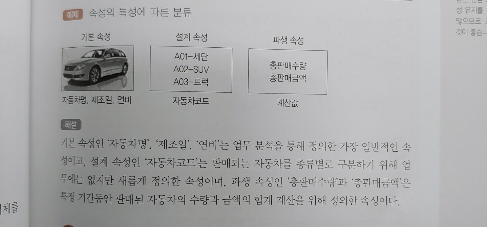

# 31. 데이터 전환(C)

1. ### 데이터 전환

   기존 정보 시스템의 데이터를 새로 개발할 시스템에서 운영할 수 있도록 **추출(Extraction), 변환(Transformation), 적재(Loading)** 하는 과정

   

2.  ### 데이터 전환 계획서

   데이터 전환작업에 필요한 모든계획을 기록하는 문서

# 32. 데이터 검증(C)

1. ### 데이터 검증

   데이터 전환 과정이 정상적으로 수행되었는지 확인하는 과정

   

2. ### 검증 방법에 따른 분류

   | 검증 방법          | 내용                                                         |
   | ------------------ | ------------------------------------------------------------ |
   | 로그 검증          | 데이터 전환 과정에서 작성하는 추출, 전환, 적재 로그를 검증   |
   | 기본 항목 검증     | 로그 검증 외에 별도로 요청된 검증 항목에 대해 검증           |
   | 응용 프로그램 검증 | 응용 프로그램을 통한 데이터 전환의 정합성 검증               |
   | 응용 데이터 검증   | 사전에 정의된 업무 규칙을 기준으로 데이터 전환의 정합성 검증 |
   | 값 검증            | 숫자 항목의 합계 검증, 코드 데이터의 범위 검증, 속성 변경에 따른 값 검증을  수행 |

   

3. ### 검증 단계에 따른 분류

   | 검증 단계    | 목적                                                         | 검증 방법                               |
   | ------------ | ------------------------------------------------------------ | --------------------------------------- |
   | 추출         | 원천 시스템 데이터에 대한 정합성 확인                        | 로그 검증                               |
   | 전환         | - 매핑 정의서에 정의된 내용이 정확히 반영 되었는지 확인 - 매핑 정의서 오류 여부 확인 | 로그 검증                               |
   | DB 적재      | 파일을 적재하는 과정에서 발생할 수 있는 오류, 데이터 누락 여부 등 확인 | 로그 검증                               |
   | DB 적재 후   | 적재 완료 후 정합성 확인                                     | 기본 항목 검증                          |
   | 전환 완료 후 | 데이터 전환 완료 후 추가 검증 과정을 통해 정합성 검증        | 응용프로그램 검증 응용 데이터 검증 |

# 33. 오류 데이터 측정 및 정제(C)

1. ### 오류 데이터 측정 및 정제

   - 고품질의 데이터를 운영 및 관리하기 위해 수행

   - `데이터 품질 분석 > 오류 데이터 측정 > 오류 데이터 정제` 순으로 진행

     

2. ### 오류 상태

   | 상태       | 내용                                                         |
   | ---------- | ------------------------------------------------------------ |
   | Open       | 오류가 보고만 되고 분석되지 않은 상태                        |
   | Assigned   | 개발자에게 오류를 전달한 상태                                |
   | Fixed      | 개발자가 오류를 수정한 상태                                  |
   | Closed     | 수정된 오류를 테스트해서 오류가 발견되지 않은 상태           |
   | Deffered   | 오류 수정을 연기한 상태                                      |
   | Classified | 보고된 오류를 관련자들이 확인했는데 오류가 아니라고 확인된 상태 |

   

3. ### 데이터 정제요청서

   데이터 정제와 관련된 전반적인 내용을 문서로 작성한 것

   

4. ### 데이터 정제보고서

   데이터 정제가 정상적으로 완료되었는지 결과를 작성한 것

# 34. 데이터베이스 개요(A)

1. ### 데이터 저장소

   - ##### 논리 데이터 저장소

     논리적인 구조로 조직화 한 저장소

   - ##### 물리 데이터 저장소

     물리적인 공간에 구축한 저장소

     

2. ### 데이터베이스

   공동으로 사용될 데이터를 중복을 배제하여 통합하고 저장장치에 저장하여 항상 사용할 수 있도록 운영하는 운영 데이터

   - ##### 운영 데이터

     조직의 고유한 업무를 수행하는데 필요한 자료

   - ##### 저장 데이터

     컴퓨터가 접근할 수 있는 저장매체에 저장된 자료

   - ##### 통합 데이터

     자료의 중복을 배제한 데이터의 모임

   - ##### 공용 데이터

     여러 응용시스템이 공동으로 소유하고 유지하는 자료

     

3. ### DBMS

   사용자의 요구에 따라 정보를 생성하고, 데이터 베이스를 관리해주는 소프트웨어

   ##### <필수 기능 3가지>

   - ##### 정의

     데이터의 정의, 이용방식, 제약 조건 등을 명시

   - ##### 조작

     데이터의 검색, 갱신, 삽입, 삭제를 위해 인터페이스 수단을 제공하는 기능

   - ##### 제어

     데이터 무결성, 보안, 권한 검사, 병행제어를 제공하는 기능

     

4. ### 데이터의 독립성

   - #####  물리적 독립성

     물리적 장치를 독립시킴으로써, 디스크를 추가/변경하더라도 응용 프로그램에는 영향을 끼치지 않음

   - ##### 논리적 독립성

     데이터의 논리적인 구조를 변경해도, 응용 프로그램에는 영향을 미치지 않음

     

5. ### 스키마

   데이터 베이스의 **구조**와 **제약조건**에 대한 전반적인 명세를 기술한 것

   | 종류        | 내용                                                         |
   | ----------- | ------------------------------------------------------------ |
   | 외부 스키마 | 데이터 베이스의 논리적 구조를 정의한 것                      |
   | 개념 스키마 | - 데이터 베이스의 전체적인 논리적 구조 - 모든 응용 프로그램이나 사용자들이 필요로 하는 데이터를 종합한 조직 전체의 데이터 베이스로 하나만 존재함 |
   | 내부 스키마 | 물리적 저장장치 입장에서 본 데이터베이스 구조                |

# 35. 데이터베이스 설계(A)

1. ### 데이터베이스 설계 시 고려사항

   | 항목    | 내용                                                         |
   | ------- | ------------------------------------------------------------ |
   | 무결성  | 데이터 조작 연산 후에도 데이터 베이스에 저장된 데이터가 제약조건을 항상 만족해야 함 |
   | 일관성  | 저장된 데이터들 사이나, 특정 질의에 대한 응답이 처음부터 끝까지 변함없이 일정해야 함 |
   | 보안    | 데이터의 노출, 변경, 손실로부터 보호할 수 있어야 함          |
   | 회복    | 장애 발생시 발생 직전의 상태로 복구할 수 있어야 함           |
   | 효율성  | 응답시간의 단축, 시스템의 생산성, 저장 공간의 최적화 등이 가능해야 함 |
   | DB 확장 | 데이터베이스 운영에 영향을 주지 않으면서 지속적으로 데이터를 추가할 수 있어야 함 |

   

2. ### 데이터베이스 설계 순서

   1. ##### 요구조건 분석

      요구 조건 명세서 작성

   2. ##### 개념적 설계

      개념 스키마, 트랜잭션 모델링, E-R 모델

   3. ##### 논리적 설계

      논리 스키마 설계, 트랜잭션 인터페이스 설계

   4. ##### 물리적 설계

      물리적 구조의 데이터로 변환

   5. ##### 구현

      데이터베이스 생성, 트랜잭션 작성

      

3. ### 요구 조건 분석

   데이터베이스를 사용할 사람들로부터 필요한 용도를 파악하는 것

   

4. ### 개념적 설계(정보 모델링, 개념화)

   - 현실 세계에 대한 인식을 추상적 개념으로 표현하는 과정

   - 개념 스키마 모델링, 트랜잭션 모델링을 병행 수행

     

5. ### 논리적 설계(데이터 모델링)

   - 현실 세계에서 발생하는 자료를 물리적 저장장치에 저장할 수 있도록 논리적 자료구조로 변환(mapping)시키는 과정
   - 트랜잭션 인터페이스를 설계한다

   

6. ### 물리적 설계(데이터 구조화)

   논리적 구조로 표현된 데이터를 물리적 구조의 데이터로 변환하는 과정

   

7. ### 데이터베이스 구현

   - 논리적 설계와 물리적 설계에서 도출된 데이터베이스 스키마를 파일로 생성하는 과정
   - 트랜잭션 작성

# 36. 데이터모델의 개념(B)

1. ### 데이터 모델

   현실 세계의 정보들을 단순화, 추상화하여 표현한 개념적 모형

   - ##### 데이터 모델 구성 요소

     개체, 속성, 관계

   - ##### 데이터 모델 종류

     개념적 데이터 모델, 논리적 데이터 모델, 물리적 데이터 모델

   - ##### 데이터 모델에 표시할 요소

     구조, 연산, 제약조건

     

2. ### 개념적 데이터 모델

   - 현실세계에 대한 인식을 추상적 개념으로 표현하는 과정

   - 정보모델이라고도 함

   - 대표적 모델로는 E-R 모델이 있음

     

3. ### 논리적 데이터 모델

   - 개념적 모델링 과정에서 얻은 개념적 구조를 컴퓨터 세계의 환경에 맞도록 변환하는 과정
   - 데이터 모델이라고 하면 논리적 데이터 모델을 말함
   - 관계모델, 계층 모델, 네트워크 모델 등이 있음

   

4. ### 데이터 모델에 표시할 요소

   | 요소     | 내용                                                         |
   | -------- | ------------------------------------------------------------ |
   | 구조     | 논리적으로 표현된 개체 타입들 간의 관계로서 데이터 구조 및 정적 성질 표현 |
   | 연산     | 데이터를 처리하는 작업에 대한 명세로서 데이터베이스를 조작하는 기본 도구 |
   | 제약조건 | 데이터베이스에 저장될 수 있는 실제 데이터의 논리적인 제약 조건 |

# 37. 데이터 모델의 구성 요소(B)

1. ### 개체

   데이터베이스에 표현하려는 것, 개념이나 정보 단위 같은 현실 세계의 대상

   

   

2. ### 속성

   - 데이터베이스를 구성하는 가장 작은 논리적 단위

   - 속성의 수를 디그리(degree)  또는 차수라고 한다

     

3. ### 속성의 특성에 따른 분류

   | 분류      | 내용                                                         |
   | --------- | ------------------------------------------------------------ |
   | 기본 속성 | - 속성 중 가장 많고 일반적임 - 업무 분석을 통해 정의한 속성 |
   | 설계 속성 | - 원래 업무상 존재하지 않고 설계 과정에서 도출해내는 속성    |
   | 파생 속성 | - 다른 속성으로부터 계산이나 변형 등의 영향을 받아 발생하는 속성 - 파생 속성은 되도록 적은 수를 정의하는 것이 좋음 |

   

   

4. ### 속성의 개체 구성 방식에 따른 분류

   | 분류        | 내용                                                         |
   | ----------- | ------------------------------------------------------------ |
   | 기본키 속성 | 개체를 유일하게 식별할 수 있는 속성                          |
   | 외래키 속성 | 다른 개체와의 관계에서 포함된 속성                           |
   | 일반 속성   | 개체에 포함되어 있고 기본키, 외래키에 포함되어 있지 않은 속성 |

   

5. ### 관계

   개체와 개체 사이의 논리적인 연결

   

6. ### 관계의 형태

   - 1 : 1

   - 1 : 다

   - 다 : 다

     

7. ### 관계의 종류

   | 종류      | 내용                                                         |
   | --------- | ------------------------------------------------------------ |
   | 종속 관계 | - 두 개체 사이의 주종관계를 표현한 것 - 식별관계, 비식별관계가 있음 |
   | 중복 관계 | 두 개체 사이에 두번 이상의 종속 관계가 발생하는 관계         |
   | 재귀 관계 | - 개체가 자기 자신과 관계를 가지는 것 - 순환 관계라고도 함 |
   | 배타 관계 | - 개체의 속성이나 구분자를 기준으로 개체의 특성을 분할 - 배타 AND 관계와 배타 OR 관계로 구분 |

# 38. 식별자(D)

1. ### 식별자

   하나의 개체 내에서 인스턴스를 유잏라게 구분할 수 있는 구분자

   

2. ### 식별자의 분류

   | 분류             | 식별자                                                       |
   | ---------------- | ------------------------------------------------------------ |
   | 대표성 여부      | - 주 식별자 : 개체를 대표하는 유일한 식별자 - 보조 식별자 : 주식별자를 대체하여 개체를 식별할 수 있는 속성 |
   | 스스로 생성 여부 | - 내부 식별자 : 개체 내에서 스스로 만들어지는 식별자 - 외부 식별자 : 외부 개체의 식별자를 가져와 사용하는 식별자 |
   | 단일 속성 여부   | - 단일 식별자 : 한가지 속성으로만 구성된 식별자 - 복합 식별자 : 두 개 이상의 속성으로 구성된 식별자 |
   | 대체 여부        | - 원조 식별자 : 업무에 의해 만들어지는 가공되지 않은 원래의 식별자 - 대리 식별자 : 주 식별자의 속성이 두 개 이상일 때, 속성들을 하나의 속성으로 묶어 사용하는 식별자 |

   

3. ### 후보 식별자

   개체에서 각 인스턴스를 유일하게 식별할 수 있는 속성 또는 속성 집합

   

4. ### 주 식별자의 특징

   | 특징   | 내용                                                         |
   | ------ | ------------------------------------------------------------ |
   | 유일성 | 개체 내의 모든 인스턴스는 주 식별자에 의해 구분되어야 함     |
   | 최소성 | 유일성을 만족시키기에 필요한 최소한의 속성으로만 구성        |
   | 불변성 | 주 식별자가 특정개체에 한 번 지정되면 그 식별자는 변하지 않아야 함 |
   | 존재성 | 주 식별자가 지정되면 식별자 속성에 반드시 데이터 값이 존재해야 함 |

   
