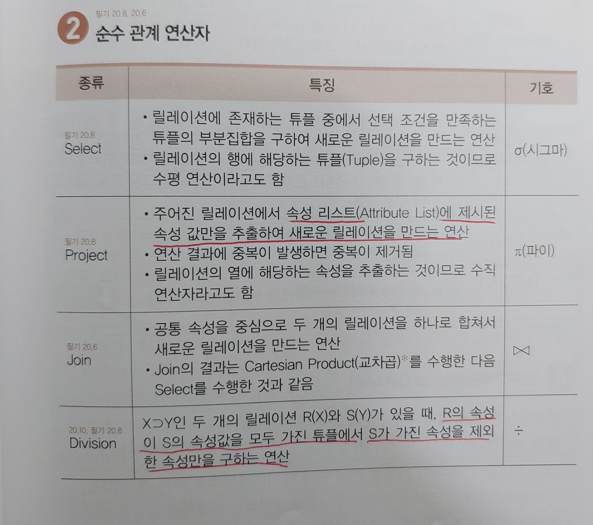
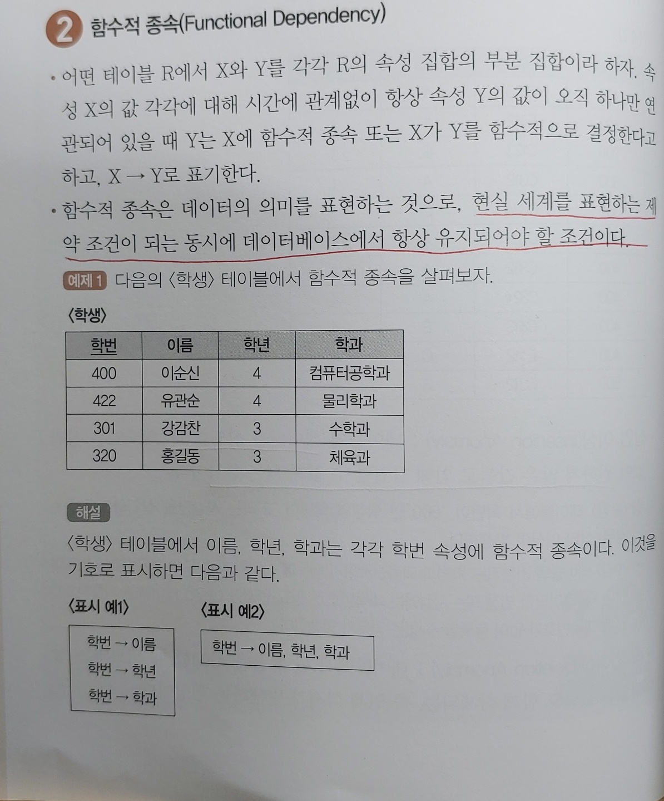
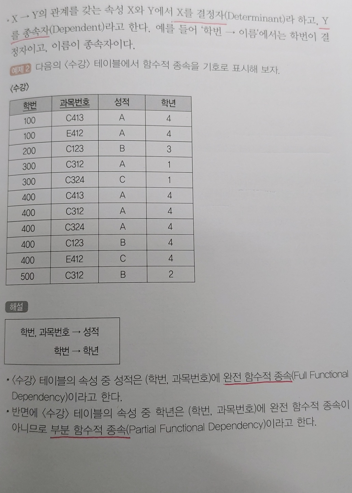

# 39. E-R(개체-관계) 모델(A)

1. ### E-R(개체-관계) 모델

   - 현실세계의 무질서한 데이터를 개념적인 논리 데이터로 표현하기 위한 방법

   - 1976년 피터 첸에 의해 제안되었음

   - 개념적 데이터 모델의 가장 대표적인 것

   - E-R 모델에서는 데이터를 개체, 관계, 속성으로 묘사함

     

2. ### E-R 다이어그램

   

# 40. 관계형 데이터베이스의 구조 / 관계형 데이터 모델(A)

1. ### 관계형 데이터베이스

   - 2차원적인 표(Table)를 이용해서 데이터 상호 관계를 정의하는 데이터베이스
   - 개체 릴레이션과 관계 릴레이션이 존재함
   - 장점 : 간결하다, 다른 데이터베이스로의 변환이 용이하다
   - 단점 : 성능이 떨어진다

   

2. ### 관계형 데이터베이스의 릴레이션구조

   

   

3. ### 튜플

   - 릴레이션을 구성하는 각각의 행

   - 튜플의 수를 카디널리티 또는 기수 라고 함

     

4. ### 속성

   - 데이터 베이스를 구성하는 가장 작은 논리적 단위

   - 속성의 수를 디그리(Degree) 또는 차수라고 함

     

5. ### 도메인

   - 하나의 애트리뷰트가 취할 수 있는 같은 타입의 원자값들의 집합

     

6. ### 릴레이션의 특징

   - 릴레이션에 포함된 튜플들은 모두 상이하다

   - 튜플 사이에는 순서가 없다

   - 속성들의 순서는 중요하지 않다

   - 튜플들의 삽입, 삭제로 릴레이션은 시간에 따라 변한다

   - 속성의 값은 논리적으로 원자값만을 저장한다

     

7. ### 관계형 데이터 모델

   - 2차원적인 표(Table)를 이용해서 데이터 상호 관계를 정의하는 DB구조
   - 가장 널리 사용되는 데이터 모델
   - 관계형 모델의 대표적인 언어는 SQL이다

# 41. 관계형 데이터베이스의 제약 조건-Key(A)

1. ### 키

   데이터베이스에서 조건을 만족하는 튜플을 찾거나 순서대로 정렬할 때 기준이 되는 속성

   

2. ### 후보키

   - 속성들 중에서 튜플을 유일하게 식별하기 위해 사용되는 속성들의 부분집합

   - **유일성**과 **최소성**을 만족시켜야 함

   - ##### 유일성

     하나의 키 값으로 하나의 튜플만을 유일하게 식별

   - ##### 최소성

     키를 구성하는 속성 하나를 제거하면 유일하게 식별할 수 없도록 최소한의 속성으로 구성

   

3. ### 기본키

   - 후보키 중에서 선정된 주키

   - 중복값을 가질 수 없다

   - NULL값을 가질 수 없다

     

4. ### 대체키

   후보키가 둘 이상일 때 기본키를 제외한 나머지 후보키

   

5. ### 슈퍼키

   - 한 릴레이션 내에 있는 속성들의 집합으로 구성된 키

   - 유일성 만족o, 최소성 만족x

     

6. ### 외래키

   다른 릴레이션의 기본키를 참조하는 속성 또는 속성들의 집합

# 42. 관계형 데이터베이스의 제약조건 - 무결성(Integrity)(A)

1. ### 무결성

   - 데이터베이스에 저장된 데이터값과 현실세계의 실제값이 일치하는 정확성

   - 쉽게말해서, 저장된 데이터베이스에 잘못된 데이터가 없다는 것

     

2. ### 무결성의 종류

   - ##### 개체 무결성

     기본키를 구성하는 어떤 속성도 NULL값이나 중복값을 가질 수 없다

   - ##### 참조 무결성

     외래키값은 NULL이거나 참조 릴레이션의 기본키 값과 동일해야 한다

   - ##### 도메인 무결성

     주어진 속성 값이 정의된 도메인에 속한 값이어야 한다

   - ##### 사용자 정의 무결성

     속성 값들이 사용자가 정의한 제약조건에 만족되어야 한다

   - ##### NULL 무결성

     릴레이션의 특정 속성 값이 NULL이 될 수 없도록 하는 규정

   - ##### 고유 무결성

     릴레이션의 특정 속성에 대해 튜플들이 갖는 속성 값들이 서로 달라야 한다

   - ##### 키 무결성

     하나의 릴레이션에는 적어도 하나의 키가 존재한다

   - ##### 관계 무결성

     - 릴레이션에 어느 한 튜플의 삽입 가능 여부

     - 한 릴레이션과 다른 릴레이션의 튜플들 사이의 관계에 대한 적절성 여부

       

3. ### 데이터 무결성 강화

   | 종류                | 내용                                                       |
   | ------------------- | ---------------------------------------------------------- |
   | 애플리케이션        | 무결성 조건을 검증하는 코드를 프로그램 내에 추가함         |
   | 데이터베이스 트리거 | 트리거 이벤트에 무결성 조건을 실행하는 절차형 SQL을 추가함 |
   | 제약 조건           | 데이터베이스 제약조건을 설정하여 무결성 유지               |

# 43. 관계대수 및 관계해석(A)

1. ### 관계대수

   - 관계형 데이터베이스에서 원하는 정보와 그 정보를 검색하기 위해 어떻게 유도하는가를 기술하는 **절차적인** 언어

   - 순수관계연산자와 일반 집합 연산자가 있다

     

2. ### 순수 관계 연산자

   

   

3. ### 일반 집합 연산자

   

   

4. ### 관계해석

   - 관계 데이터의 연산을 표현하는 방법
   - 원하는 정보가 무엇이라는 것만 정의하는 **비절차적** 특성을 지닌다

# 44. 이상/함수적 종속(B)

1. ### 이상

   - ##### 삽입이상

     데이터를 삽입할 때 의도치 않게 원하지 않는 값들로 인해 삽입할 수 없게 되는 현상

   - ##### 삭제이상

     한 튜플을 삭제할 때 의도치 않게 상관없는 값들도 함께 삭제되는 현상

   - ##### 갱신이상

     튜플에 있는 속성 값을 갱신할 때 일부 튜플의 정보만 갱신되어 정보에 불일치성이 생기는 현상

     

2. ### 함수적 종속

   

   

# 45. 정규화(A)

1. ### 정규화

   가능한 한 중복을 제거하여 이상의 발생 가능성을 줄이기 위해 테이블을 무손실 분해하는 과정

   

2. ### 정규화 과정(1,2,3,BCNF,4,5)

   책 참고

# 46. 반정규화(A)

1. ### 반정규화

   - ##### 정규화된 데이터 모델을 의도적으로 통합, 중복, 분리하여 정규화 원칙을 위배하는 행위

   - ##### 성능 향샹, 관리 효율성 증가

   - ##### 데이터 일관성 저하, 정합성 저하

   - ##### 반정규화 방법

     - 테이블 통합
     - 테이블 분할
     - 중복 테이블 추가
     - 중복 속성 추가

   

2. ### 테이블 통합

   두개의 테이블이 조인되어 사용되는 경우가 많을 경우 성능 향상을 위해 하나의 테이블로 만들어 사용하는 것

   

3. ### 테이블 분할

   테이블을 수직 또는 수평으로 분할 하는 것

   | 방법      | 내용                                                         |
   | --------- | ------------------------------------------------------------ |
   | 수평 분할 | 레코드를 기준으로 테이블을 분할하는 것                       |
   | 수직 분할 | 하나의 테이블에 속성이 너무 많을 경우 속성을 기준으로 테이블을 분할 하는 것 |

   

4. ### 중복 테이블 추가

   작업의 효율성을 증가시키기 위해 테이블을 추가하는 것

   | 방법                                 | 내용                                                         |
   | ------------------------------------ | ------------------------------------------------------------ |
   | 집계 테이블의 추가                   | 집계 데이터를 위한 테이블을 생성하고 각 원본 테이블에 트리거를 설정하여 사용하는 것 |
   | 진행 테이블의 추가                   | 이력 관리 등의 목적으로 추가하는 테이블                      |
   | 특정 부분만을 포함하는 테이블의 추가 | 테이블의 특정 부분만으로 새로운 테이블을 생성                |

   

5. ### 중복 속성 추가

   - 자주 사용하는 속성을 하나 더 추가하는 것
   - 무결성 확보가 어렵고, 디스크 공간이 추가로 필요

